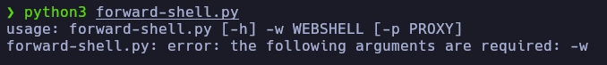
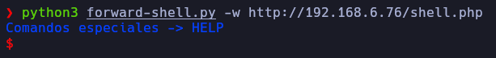
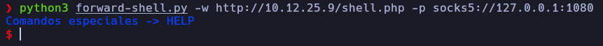
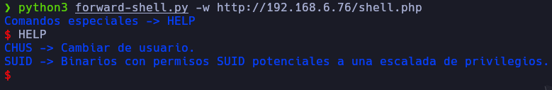
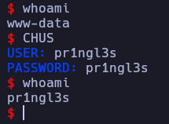
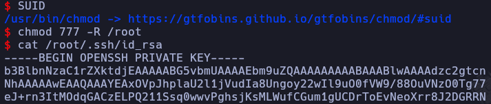

# Forward-Shell.sh
En algunas situaciones, puede no ser factible establecer una Reverse Shell o una Bind Shell debido a restricciones específicas del firewall, como reglas de iptables, que limitan la apertura de determinados puertos.

Este script utiliza archivos **mkfifo** para simular una shell con una TTY completamente interactiva a través de una webshell, lo que facilita una navegación mucho más cómoda por el sistema.

>  [!TIP]
> Los archivos mkfifo, también conocidos como "named pipes" o "named FIFOs" (First In, First Out), son un tipo especial de archivo en sistemas operativos tipo UNIX que actúan como tuberías de comunicación entre procesos.

El único requisito para ejecutar el script correctamente es cargar en la máquina que se desea comprometer un archivo con una estructura PHP similar a la siguiente:

```php
<?php
	system($_GET['cmd']);
?>
```

# ¿Cómo funciona?

Al ejecutar el script, se solicitará que se introduzcan varios parámetros:

<p align="center">
	
</p>

Uno de ellos es el parámetro **-w**, que corresponde a la URL donde está alojado el archivo:

<p align="center">
	
</p>

El parámetro **-p** corresponde al proxy a través del cual se está accediendo a la página, en caso de que sea necesario para acceder a la misma:

<p align="center">
	
</p>

Una vez ejecutado el script, se mostrará una ayuda que incluye varios comandos "especiales" diseñados para facilitar la navegación del usuario:

<p align="center">
	
</p>

El primero de ellos es el **CHUS**, que permite un cambio de usuario más cómodo en caso de ser posible:

<p align="center">
	
</p>

El siguiente es el **SUID**, que facilita la identificación rápida de binarios con permisos SUID que podrían ser potenciales a una vulnerabilidad de escalada de privilegios, incluyendo un enlace que detalla cómo podría ser explotada dicha vulnerabilidad:

<p align="center">
	
</p>

> [!NOTE]
> El proyecto podría experimentar cambios y mejoras en el futuro.
